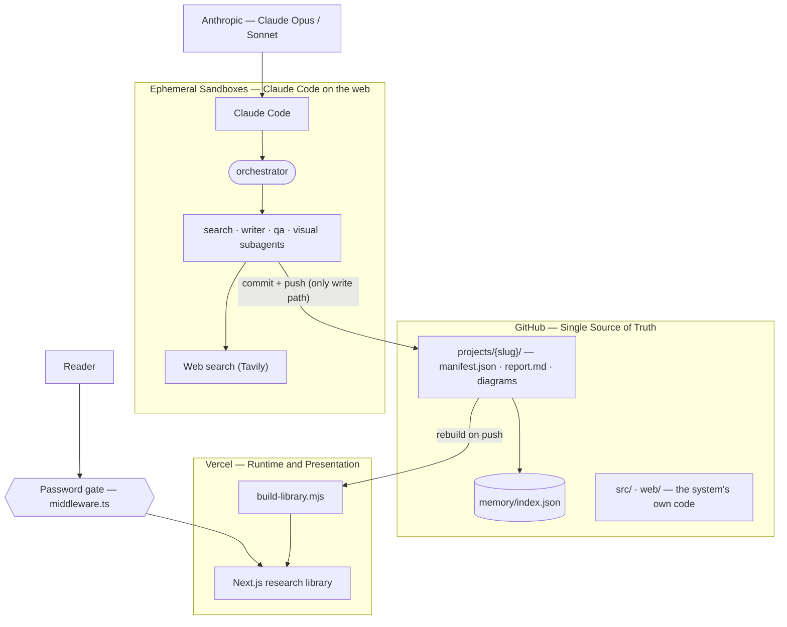
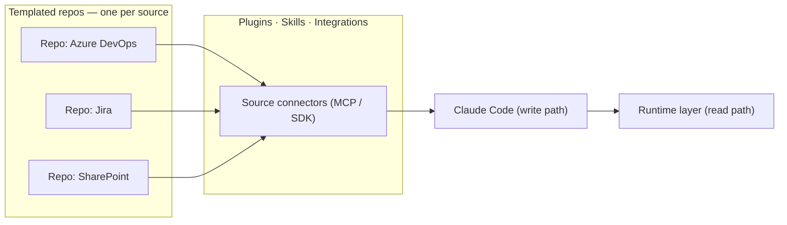

# Research Agent Architecture

How this system is wired — **GitHub at the center as the single source of truth, Claude Code as the write path, and a runtime layer (Vercel today) as the read path** — and why that shape is a reusable template, not a one-off.

> A companion animated deck (`deck.html`) builds the architecture diagram scene by scene.

## Executive Summary

This research agent is one concrete instance of a **reusable architecture pattern**. At the center sits a **GitHub repository** that is the single source of truth: a folder of published projects (`projects/<slug>/`) plus the code that produces them. On one side, **Claude Code** — running as agents inside ephemeral cloud sandboxes, powered by Anthropic's Claude models — is the *only* thing that writes to that truth: it researches, composes, and commits. On the other side, a **runtime layer** (Vercel today) renders the repo into a browsable product, with a lightweight **password gate** as the authentication layer on top. Nothing is hand-curated; everything the reader sees is *derived* from the repo on each push.

The important move is that the inside of this pattern is swappable. Keep GitHub as the hub, keep Claude Code as the write path, keep a runtime as the read path — then change *what the agents produce* and *what the runtime renders*, and you get a **family of products from one template**: a research library here, a graph-database-backed app next, a project-management surface after that. This report documents the concrete architecture, then generalizes it into templated repos, and closes with how the runtime layer evolves from Vercel to the **Advisory Digital Gateway** — including a short-term quick win you can do now.

## The Pattern in One Sentence

**GitHub is the source of truth; Claude Code is the write path that changes it; the runtime layer is the read path that presents it; auth sits on top of the read path.**

Everything below is either a concrete realization of that sentence or a variation on what you put inside it.

## The Core Architecture

### GitHub — the single source of truth

The repository is canonical. Specifically, `projects/<slug>/manifest.json` is the **contract** every downstream consumer reads, and the `projects/` folder is the one place anything is "real." The web library and the shared-memory index are both *derived* from it — never hand-edited. A research run that finishes without publishing a manifest has produced nothing the system can see.

Three things live in the repo and matter here:

- **`projects/<slug>/`** — one folder per deliverable: `manifest.json` (metadata + provenance), `report.md` (the canonical report), plus decks, diagrams, and optional Office files. The slug is **deterministic**, so re-running a topic targets the *same* folder and revises it in place — a **living report** that bumps `version` and appends a `changelog` entry while preserving `created`.
- **`memory/index.json`** — a keyword index *derived* from the manifests, so future runs can recall prior conclusions before researching.
- **`src/` and `web/`** — the system's own code: the agent pipeline that writes projects, and the Next.js app that reads them.

### Anthropic + ephemeral sandboxes — the write path (Claude Code)

The write path is agentic. **Claude Code** runs inside **ephemeral cloud sandboxes** (Claude Code on the web): isolated containers that clone the repo fresh at start, do work, and are reclaimed afterward — so anything worth keeping must be committed and pushed. Inside a sandbox, an **orchestrator** agent coordinates four specialized subagents through a phased workflow (recall → decompose → research → write → QA → revise → visuals → output → publish):

- **search-agent** — web search via **Tavily** plus source-reliability scoring,
- **writer-agent** — report composition weighted by source tier,
- **qa-agent** — accuracy/coherence review, and
- **visual-agent** — Mermaid diagrams.

These agents reach *out* to the web for evidence and reach *in* to the repo to publish. The decisive property: **Claude Code is the only write path to the source of truth.** Humans don't hand-curate the library; agents commit to it. Because the sandbox is ephemeral and the slug is deterministic, re-running a topic produces a clean, reproducible *revision* of the same project rather than drift.

### Vercel — the runtime and presentation layer

The read path is a deployment. **Vercel** hosts a **Next.js** app that turns the repo into a browsable library. Before each build, `web/scripts/build-library.mjs` reads every `projects/<slug>/manifest.json`, copies servable artifacts into `web/public/library/<slug>/`, renders `report.md` to HTML, and emits a typed `library.generated.ts`. So the loop closes end to end: **research a topic → it publishes a project → commit and push → Vercel rebuilds → the card appears.** No manual wiring.

On top of the runtime sits the **authentication layer**: a single-password gate enforced in `web/middleware.ts`. The password is read only on the server; a successful login sets an httpOnly cookie holding a SHA-256 token, and the middleware verifies it on every request, redirecting to `/login` otherwise. It's a lightweight gate for low-stakes deployments — a white-label cover over the read path, not a multi-user identity system.

### The living-reports loop

Put the two paths together and the repo becomes a **continuously improving asset**: agents publish, the runtime presents, readers consume, and re-running any topic revises the same folder in place. The repo's git history *is* the audit trail; the manifest *is* the provenance record.

### The diagram

The whole system in one picture — GitHub at the center, the write path feeding in from one side, the read path rendering out the other, auth on top:



## Templated Repos: Making the Pattern Reusable

The reason to draw GitHub at the center is that the *center stays fixed while the inside changes*. A **template repository** captures the invariant scaffolding — the `projects/`-style source-of-truth contract, the Claude Code write path, the runtime + auth read path — and each new product is a repo stamped from that template with a different payload. Two payloads are especially valuable.

### Pattern A — Graph database + an agentic parsing layer

Here the deliverable isn't a Markdown report; it's **structured data**. The template's agents become a **data-parsing layer**: Claude Code ingests sources, extracts entities and relationships, and writes them into a **graph database** that sits underneath the app. The runtime renders the graph (explorer, search, relationship views) instead of rendering reports.

```mermaid
flowchart LR
  src["Source documents / feeds"]
  subgraph parse["Agentic parsing layer (Claude Code)"]
    extract["Extract entities + relationships"]
  end
  graph[("Graph database")]
  app["App (runtime layer)"]
  src --> extract
  extract -->|"commit schema + data"| graph
  graph --> app
```

The repo still holds the source of truth (the parsed graph data and the parsing logic), Claude Code is still the only thing that writes it, and the runtime still presents it. Only the *shape* of the payload changed — from prose to a graph.

### Pattern B — A project-management layer with plugins, integrations, and skills

Here the deliverable is a **working surface over external systems**. The template gains **plugins / skills / integrations** that let the agents read and write real tools of record — for example **Microsoft Azure DevOps** (work items, boards, pipelines), and by the same mechanism Jira, SharePoint, or ServiceNow. You then maintain **a set of repos, one aimed at each source**: a DevOps repo, a Jira repo, a SharePoint repo — each stamped from the same template, each with the integration/skill for its source.



Both patterns share the *same* skeleton as the research agent. That's the point of templating: **make the patterns real once, then stamp them.** A new source is a new repo from the template plus one connector — not a new architecture.

## Hosting Evolution: Vercel Today → Advisory Digital Gateway Tomorrow

The runtime layer is the most swappable part of the pattern, because the read path consumes a stable contract (`projects/` + manifests). Today it's **Vercel** — fast to ship, Git-native (push to deploy), with the password gate as cover. The long-term target is the **Advisory Digital Gateway** — the governed Azure subscription where engagement workloads live (see the *Azure Workspaces* project). Moving there trades Vercel's convenience for enterprise identity, data-residency, and governance inside an engagement boundary.

Because the read path only consumes the repo, that migration is *isolated*: the write path (Claude Code) and the source of truth (GitHub) don't change. You're re-hosting the Next.js read layer, not rebuilding the system.

### The short-term quick win

You don't have to choose all-at-once. The pragmatic move **now**:

1. **Keep shipping on Vercel behind the password gate.** It already works end to end and proves the loop; treat it as the live demo surface.
2. **Set `APP_PASSWORD` and lock the repo's deploy** so the gate is real rather than the default. This is the white-label auth layer, today, with zero new infrastructure.
3. **Keep the read path portable.** Since the app is a standard Next.js build reading a static `projects/` contract, the interim Azure step is a **static export / containerized Next.js** deployed into the Digital Gateway subscription — fronted by Entra ID instead of the password gate when governance requires it. No change to agents or the repo.

In short: **ship on Vercel now, evolve the host later** — the source of truth and the write path are already where they need to be.

## Key Takeaways

- **GitHub is the source of truth.** `projects/<slug>/manifest.json` is the contract; the web library and memory index are *derived*, never hand-curated.
- **Claude Code is the only write path.** Agents in ephemeral Anthropic-powered sandboxes research, compose, and commit — humans don't curate the library, runs do.
- **The runtime layer is the read path.** Vercel renders the repo into a Next.js library on every push, with a single-password gate (`middleware.ts`) as the authentication layer on top.
- **Living reports:** a deterministic slug means re-running a topic revises the same folder in place — bumping `version` and appending a `changelog`.
- **The pattern is templatable:** keep the GitHub-centered skeleton and swap the payload — a **graph database + agentic parsing layer**, or a **project-management layer** with plugins/skills for sources like **Microsoft Azure DevOps** (one repo per source).
- **Hosting evolves, the core doesn't:** Vercel today → **Advisory Digital Gateway** tomorrow; the short-term quick win is to ship on Vercel behind a real `APP_PASSWORD` now and keep the read path portable for an Azure move later.
